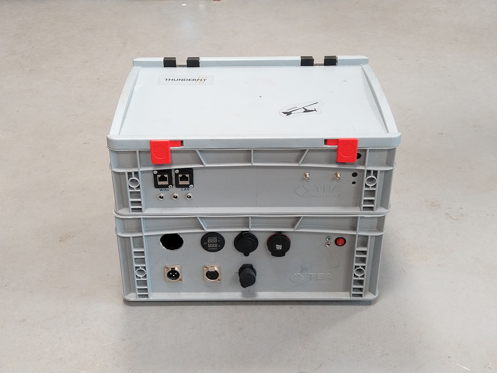

# TF-GCS01 - ThunderFly mobile ground control station 

Suitable for use in cars or boats where there is a bigger load capacity for ground supporting hardware is available. 

## Features

  - Multi antenna support thanks to integrated [TFMODEM hardware](https://github.com/ThunderFly-aerospace/TFMODEM01)
  - Backup power supply (UPS)
  - Integrated Turris [MOX router](https://www.turris.com/en/mox/overview/) to create mobile on-board network
  - Compact logistics size 400x300x300 mm to fit on [EUR-pallet](https://en.wikipedia.org/wiki/EUR-pallet)
  
